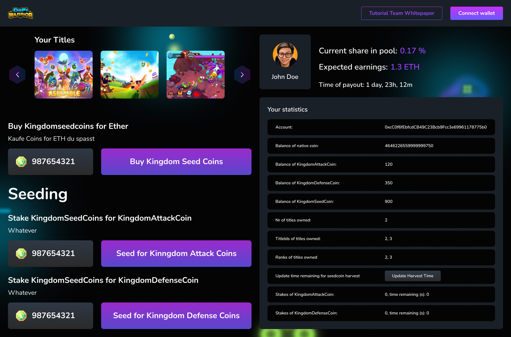
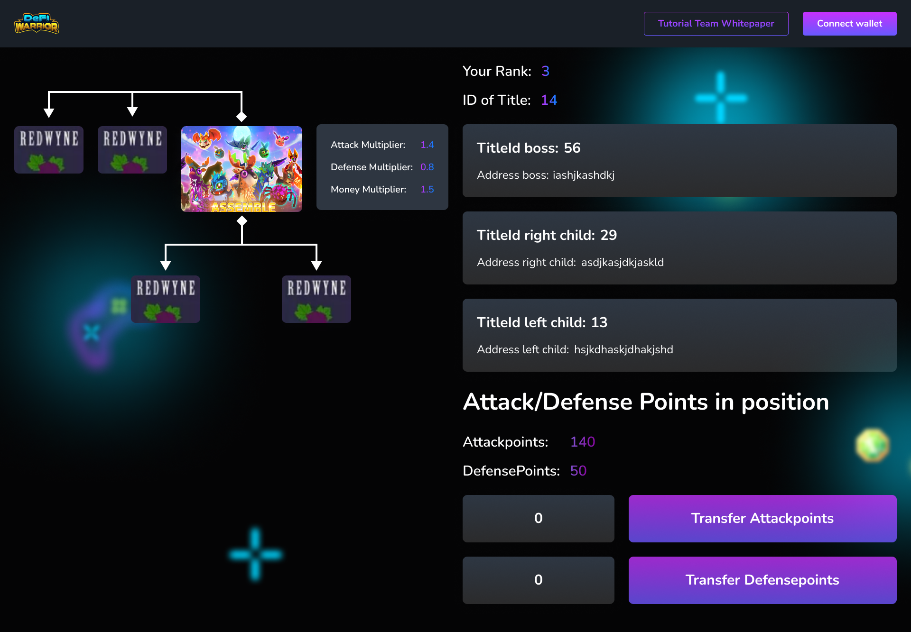

# Kingdom Game Documentation

Sorry for weird english, it's mostly dictated

In the Kingdom game, you are supposed to purchase titles that NFTs which represent a position in a binary tree. Meaning they can only be one title, ranked at the top and several ones below. Each title has one left child And one right child. Titles are supposed to have special attributes that influence several settings in the game.

Furthermore, The game has different coins. The first one is seed coin, which can be planned to get attack and defense coins. The seed coin is supposed to be purchasable or tradeable such that people can buy it for B&amp;B, And the other two can only be created if you plant or stake the seed coin.

After creating the different coins, they can then be attached to a title, Meaning a title can have for example 1000 attack points and 5000 defense coins. These attached coins are then influenced by the special attributes mentioned above. For example, if a title has an attack coin multiplier of 1.4, The attached attack coins are then multiplied in the game by 1.4.

The distribution of attack, defense, And money coin multipliers are done mathematically with the function \_calculateMultiplierPoints.

## UI / Frontend

I am providing some examples of the front and maybe it will help you to understand the logic.

## Account overview screen

On this screen, all the different titles of a person should be listed. Meaning one wallet address can actually have multiple titles.

To get all titles owned by an address function getIdsOfAddress(address) can be used.

Also, there should be a possibility to buy seed coin for Ethereum (KingdomBank: buyForETH()). I am not sure if that is happening in other contracts, but please tell me if there&#39;s a better way to do it. All. For example, it would make more sense to just adds the example pancake swap Pool link.

Then for Staking/Seeding Impossibility to stake seed coin for attack and defense coins.

On the statistics overview, there should then be the current stakes and the time remaining until a stake is finished.

Furthermore, in the statistics overview, they&#39;re just a simple balance of functions for the seat attack in defense coins. The same balance of function works for the NFT, so does the number of titles owned.

The information on the top, so the current share in Pool in the expected earnings are not yet implemented, but we will do that in the next step. The same is true for the function KingdomTitles.payOutDividends(), because logic doesn&#39;t really work yet. My idea is basically that the money earned For burning and exchanging in the, for example, pancake swap pool, Is distributed to the different titles according to their rank every month. Meaning a title at the top will have more money or more share in this payout, and a title The lower positions will have less share of the payout. Additionally, the money multiplies of each title should be remembered, meaning that if a title has a higher money multiplayer than his payout should be higher.

## Title Detail Screen

The details screen is supposed to show information about one title. On the left side, you&#39;re supposed to see where your title is in this binary tree, As well as an image of this NFT. The images are generated in another script and can be used later. They do not exist yet, but maybe just use placeholders for now. Next to the image of the NFT should be the individual settings, So the attack multiplier, defense multiplier, and money multiplier. Then on the upper right, your rank should be shown in this binary tree as well as the id of the title. Oh, that&#39;s the title id of the boss. So basically the person above in this binary tree should be shown as well as his wallet address. An below that the child&#39;s or servant should be shown, so the title id of the right child and left child as well as their addresses.

Finally below that should be the area where you can attach the attack and defense points of your wallet to this title.

# Backend / Contracts

## KingdomTitles.sol

This contract is supposed to handle The NFTS or titles of the game. The titles are stored in a structure called Kingdom title. And like said above, the title can have attack and defense points attached. Additionally, each title can have a rank which is stored in the mapping title2rank. And this is due to the reason that if an attacker Defeats the defender. Their ranks will swap, meaning for example, if you look at the binary tree example above if The title with the Rank 2 attacks rang number one and defeats him in. This is in general duties reason that he has more attack points and the opponent has defense points, Then the ranks will swap, meaning the former rank one will be on ranked two. And the attacker previously been unranked, 2 is now on rank one. The important thing to remember is that the title ID or the title number stays the same, But only the rank can change.

## KingdomBank, KingdomSeedCoin, AttackCoin, DefenseCoin

The contracts of the attack defense and seed coin are pretty basic. Their logic is handled in the Kingdom Bank. The logic should work in a way that you can plan seed coins and after a fixed time X you will get some seed coin back, but also the attack and defense points. If you wanted to stay too. Meaning this is basically just a simple staking contract, That gives you attack or defense points.

A function that didn&#39;t totally work was the getTimeUntilStakingDone function. I want it to show the remaining time for steak to be finished such that you can just easily see in the front and when you can UN stake your stakes.

## KingdomGameMechanic.sol

In this contract, the game logic is handled. So for example, if you are attacking a higher title Aussie attack in Defence logic is handled in there and also if you&#39;re swapping ranks. For this, the first functions are dealing a lot with getting your left child, getting the right Childs, meaning servants basically also the boss, because that is important to remember that you can only attack the person above you in this binary tree. Meaning again, if you&#39;re looking at the image above, And you&#39;re ranked number two, you can only attack ranked number one. Or for example, rank number 13 can only attack rank number 6.

And again, remember that title, ideas or title numbers are not the same as the rank ID. Because Rank ID can change if you&#39;re attacked, But never the title ID.

In this contract, there&#39;s this functionassignMilitaryToTitle. Which takes Attack or defense coins from your wallet and attaches them to a title. Probably the biggest function in this contract is the attackBoss function. This crash is sometimes because I guess it is too big, so maybe you know a way round to make it more efficient. But the general idea is that if you&#39;re attacking your boss, So meaning the position above you in this binary tree, Ur attack points are calculated against a defense points plus a little of their attack points, And if the calculation works in your way, you will win and sack their title. So basically your rank and their rank will swap. In general, the defense points should be valued more than attack coins, meaning to actually attack someone, you need way more attack points. We should basically work like in a castle where it&#39;s easier to defend, but you actually need heavier troops to Attack it.
