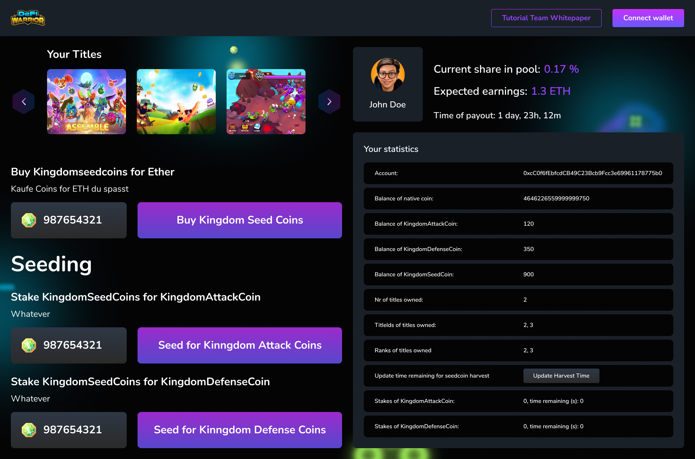
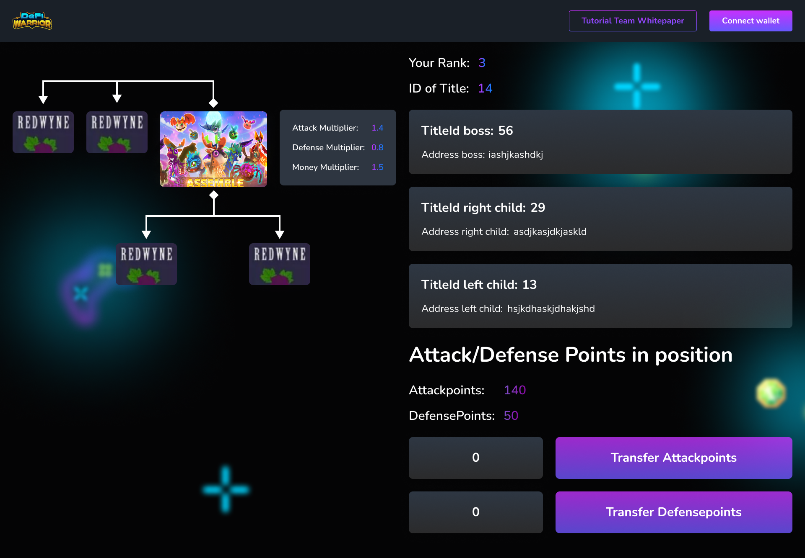

take a look at the App.js for an example workflow




the testnet contracts are located at:
https://testnet.bscscan.com/address/0x00cb28C0dd07f9277C724E525f895f45b42B6ad7

# contract addresses

## testnet

| contract name | address |
| --- | --- |
| Migrations | 0x5F072463DCdfB477EA64C3E7b1bE3A4EEF51F388 |
| KingdomSeedCoin | 0xfEB13B34cBEd0BB0bcb915078a16dD0325E63ea9 |
| KingdomAttackCoin | 0x14F1F8aa35D30E590e874221DE7Dc51B2d649B78 |
| KingdomDefenseCoin | 0x530Bc31fE22e5b13073D7A733B9a5FAD8204BE7D |
| KingdomGameMechanic | 0x0d04fDaf05490fdF6B8D6CE53DAFf714708e2f09 |


there are 3 erc20 contracts which are basically coins

```
    const kgdatDataDF = await KingdomDefenseCoin.networks[networkId];
    const kgdatDataSC = await KingdomSeedCoin.networks[networkId];
    const kgdatDataBC = await KingdomGameMechanic.networks[networkId];
```

then there is one contract which is basically an ERC721 referring to titles/NFT a person can own, see the main readme for this.
`contracts/KingdomTitles.sol`

The KingdomTitles is then inherited by `contracts/KingdomBank.sol` which regulates payment, and then finally inherited by `contracts/KingdomGameMechanic.sol` which contains all the game mechanics. 

# functions

## staking

### 1. buy kingdomseedcoin for ethereum

kingdomseedcoin can be bought for ETHereum

KingdomBank.sol, line 71
```
function buyForETH() external payable contractHasSeedcoins {
```

### 2. Plant/Stake seedcoin for attack & defensecoins

a user can stake / plant seedcoin for attack & defensecoins

targetCoin:
0: attackCoin
1: defenseCoin

KingdomBank.sol, line 83
`function plantSeeds(uint nrSeedCoins, uint8 targetCoin) public contractHasAttackcoins contractHasDefensecoins {`


### 3. get current staked coins

returns an array of how many coins are currently staked 
[attackPoints, defensePoints, activeStakes]

KingdomBank.sol, line 111
`function getCurrentStakes() public view returns(uint[3] memory){`

### 4. time until staking is done

returns time in seconds until open stakings are done

KingdomBank.sol, line 134
`function getTimeUntilStakingDone() public view returns(uint[3] memory timeuntildone){`

### 5. harvest all stakes/planted coins

gets all coins that are ready to be unstaked. 

`function harvestAll() public returns (bool success) {`

## positions and titles

please read the main readme as an introduction to this.

each title has a rank. titleid is fixed, but ranks can change, depending on if you attack your "boss" and win, in which case you are swapping the ranks.

the titles are arranged in a binary tree, meaning each title has one left, and one right child. Children can attack the boss, and if they have more attackpoints than the defensepoints of the boss, the rankids are swapped.

a lot of title functions are stated in `contracts/KingdomTitles.sol`

All mechanics regarding attacking and swapping are stated in `contracts/KingdomGameMechanic.sol`

### 6. get servants / children

returns the two children of an id

KingdomGameMechanic.sol, line 65
`function getServants(uint id) public view returns (uint left, uint right) {`

### 7. getBossRank getBossId

returns the titleId and RankId of the boss, given the playerId (titleId)

## game mechanic

each title has several attributes
attack and defensecoins can be transferred to a title, and then be used to attack or defend again other people.

KingdomGameMechanic.sol, line 117
```
    function getTitleStats(uint titleId) public view returns (uint attackPoints, uint defensePoints, bool ready4attack, uint attackMultiplier, uint defenseMultiplier, uint moneyMultiplier) {
        require(titleId <= currentPosition(), "title id not yet assigned, go get one");
        attackPoints = kingdomtitles[titleId].attackPoints;
        defensePoints = kingdomtitles[titleId].defensePoints;
        ready4attack = kingdomtitles[titleId].readyTimeAttack >= block.timestamp;
        attackMultiplier = kingdomtitles[titleId].attackMultiplier;
        defenseMultiplier = kingdomtitles[titleId].defenseMultiplier;
        moneyMultiplier = kingdomtitles[titleId].moneyMultiplier;
        return (attackPoints, defensePoints, ready4attack, attackMultiplier, defenseMultiplier, moneyMultiplier);
    }
```

the attackmultiplier and defensemultiplier multiplies the own atack and defensecoins with that multiplier. the moneyMultiplier gives each player a higher payout once per month.

### 8. assigning attack and defense coins to a title

`function assignMilitaryToTitle(uint nrCoins, uint32 titleId, uint coinType) public {`

`function withdrawMilitaryFromTitle(uint nrCoins, uint32 titleId, uint8 coinType) public {`

### 9. attack boss 

as described above, you can attack your boss, which will emit an attackresult event, which should be displayed in the frontend, and if successfull a sacking event.

`function attackBoss(uint titleId) public hasTitle {`
